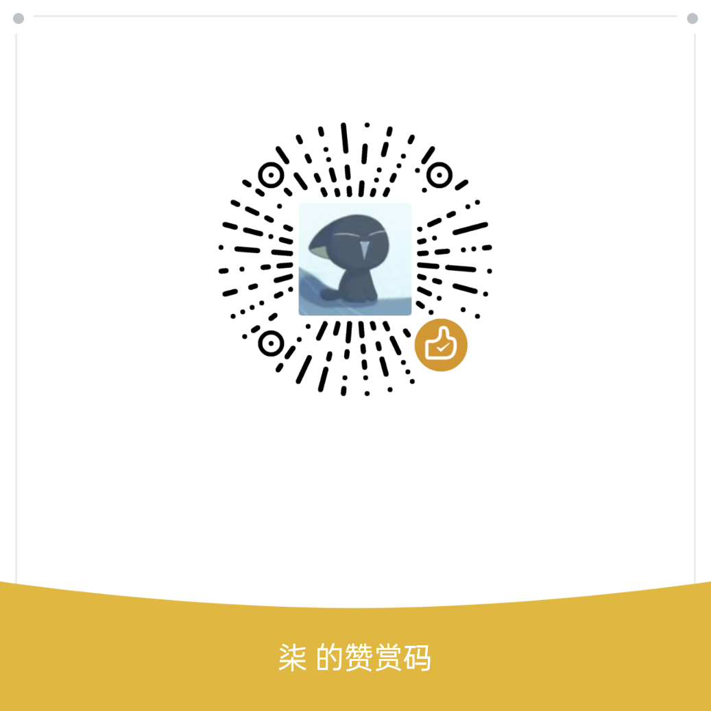

# 小石榴

> 安全、美观的广东财经大学教务系统**三方**客户端。

    

### 近期更新（未发布）

#### 4月20日

- 修改图标
- 修改设置页面

#### 4月14日

- 修改模块页面
- 修改课表页面

#### 4月13日

- 修改 tessdata 源
- 使用 GitLab API 替换 Gitee

#### 4月12日

- 移除校园网支持
- 修改 Markdown 显示，添加教务通知渲染

#### 4月9日

- 更新依赖

## 支持的平台

- Android
- Windows

## 快速开始

1. 下载软件。你可以在[发行版](https://github.com/Kiteio/Punica/releases)中下载石榴。

2. 登录账号。打开软件（记得连上校园网或开启VPN），切换到设置页面，打开教务系统账号页面，点击右上角加号，登录教务系统账号。
    

        
    

## 支持

如果你喜欢石榴，请点亮仓库星标或向好友分享，让更多人发现它。

如果有条件的话，可以扫码捐款，感谢你的支持！

   

## 截图

    
    
    

    

