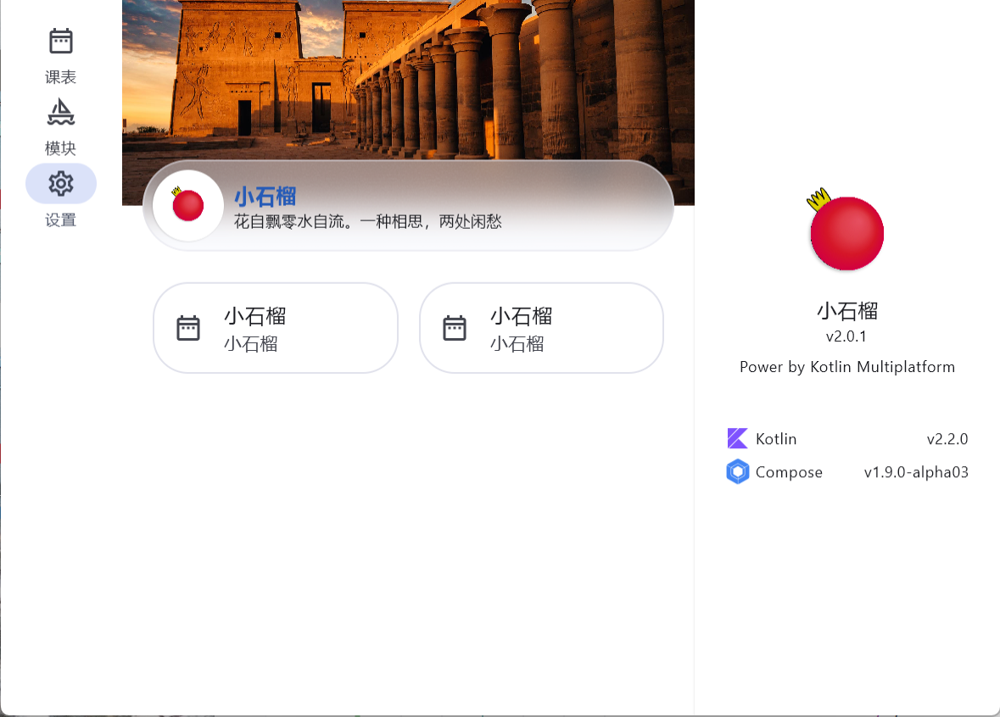
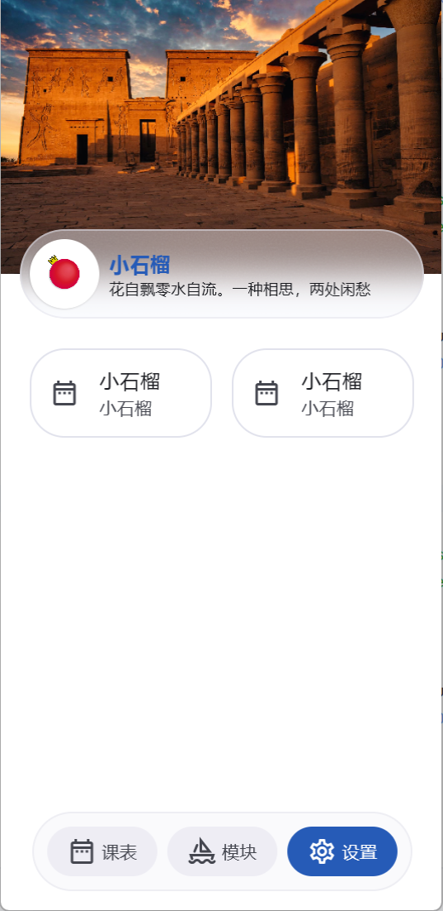
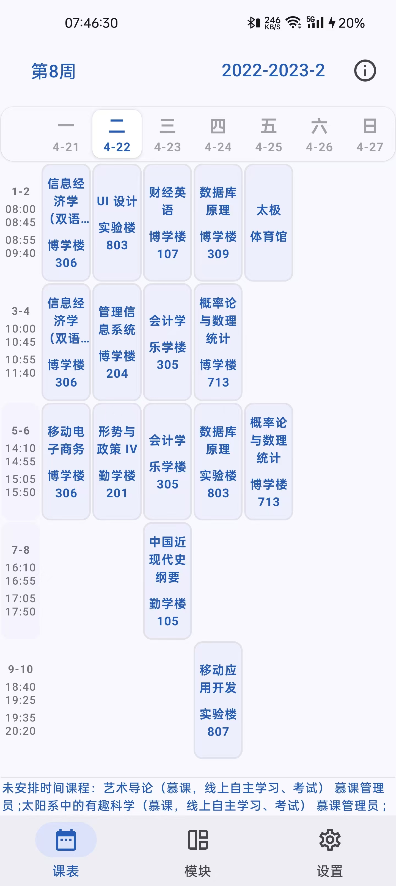
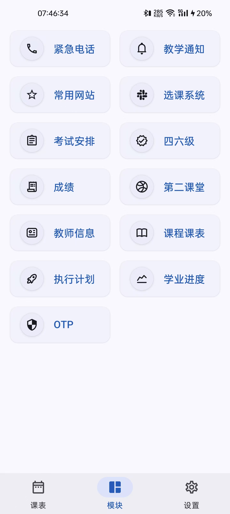
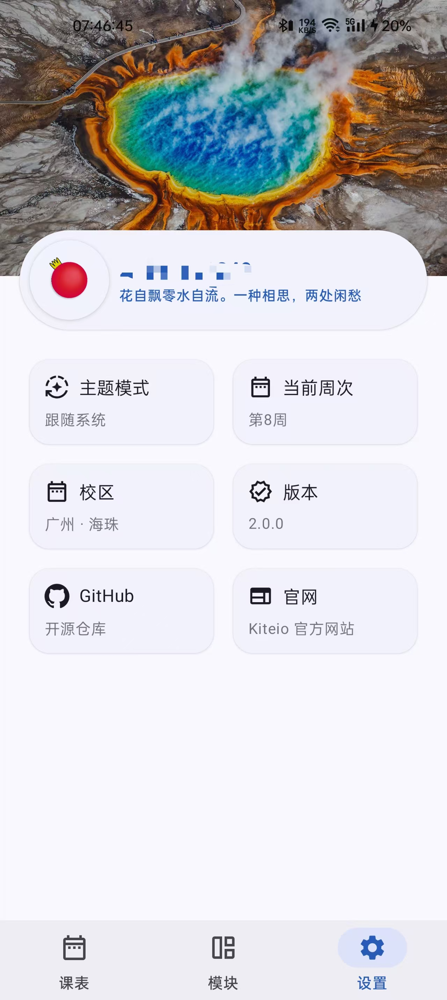
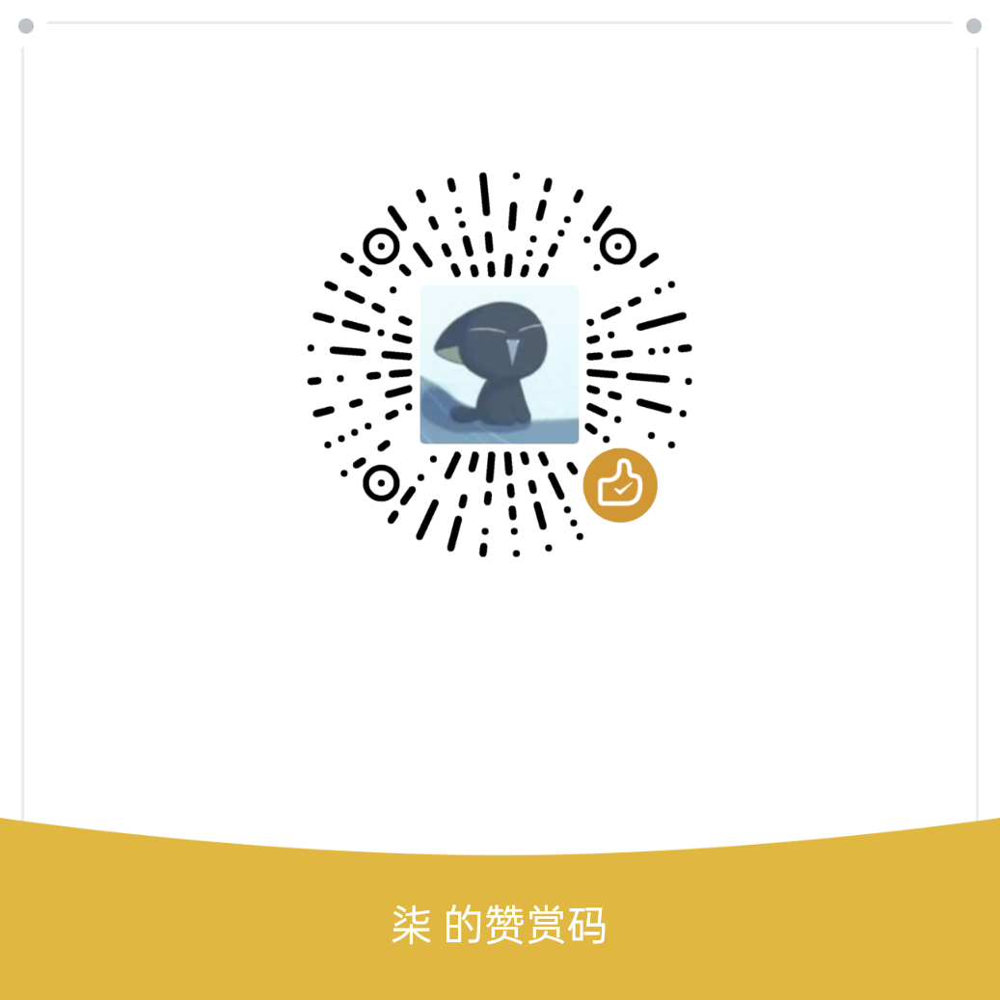

# 小石榴：领先的广财教务系统

> 9月23日，我回来了，我的时间实在有限，但石榴是我最后的念想，我不想放弃。

我们计划对软件架构进行重大调整。

> ChanwingChow：石榴承载了我四年的编程梦，也让我结识了待我最好的女友。时间不歇，四年大学已经接近尾声，而石榴仍潺潺而流。

    

    <strong><big>更新日志</big></strong>

##### 9月23日

- 新增登录页面

##### 7月16日

- 新增设置页面镜像（重构）

##### 7月12日

- 新增 Koin 依赖注入

##### 7月7日

- 新增导航页面镜像（重构）

##### 7月6日

- 新增主题镜像（重构）

##### 7月5日

- 新增 web VPN 和 TOTP 镜像（重构）

##### 7月2日

- 新增教务通知镜像（重构）
- 新增选课系统镜像（重构）

##### 6月24日

- 新增 CET 镜像（重构）
- 新增 Bing 镜像（重构）

##### 6月23日

- 新增第二课堂镜像（重构）

##### 6月22日

- 新增免听申请
- 新增培养方案
- 新增毕业审核镜像（重构）
- 新增等级成绩镜像（重构）
- 新增课程成绩镜像（重构）
- 新增学籍预警
- 新增学期日期镜像（重构）

##### 6月21日

- 新增教师信息镜像（重构）
- 新增学业进度镜像（重构）
- 新增执行计划镜像（重构）
- 新增考试安排镜像（重构）
- 新增课程课表镜像（重构）

##### 6月18日

- 新增课表镜像（重构）

##### 6月14日

- 新增 OCR 镜像（重构）

##### 6月11日

- 新增毕业审查功能（Compose Multiplatform ~~Beta~~ Alpha 版本有 Bug，桌面端无法运行）

## 简介

小石榴是一款**三方**的教务系统软件，由广东财经大学 21 级学生开发。如果你已经厌倦了那难用的网页端教务系统和庞大的套壳软件，小石榴值得一试。

小石榴 UI 基于 [Compose Multiplatform](https://www.jetbrains.com/zh-cn/compose-multiplatform/)
设计，提供查课表、查成绩、选课等功能。

小石榴完全开源，个人数据全部保存于本地，更加便捷可靠。

## 截图

    
    
    

## 支持

小石榴是一款公益项目，软件完全免费且无广告。好的软件需要有更多人发现，如果你喜欢石榴，请点亮仓库星标。
此外，你也可以向好友分享它。

如果有条件的话，可以扫码请我喝杯奶茶，感谢支持！

   

