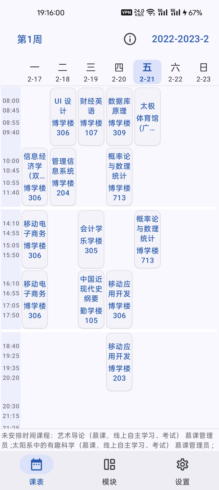
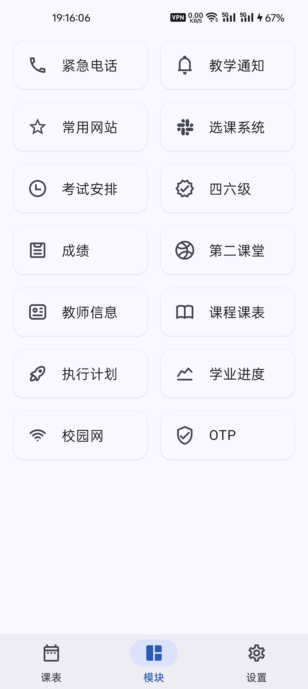
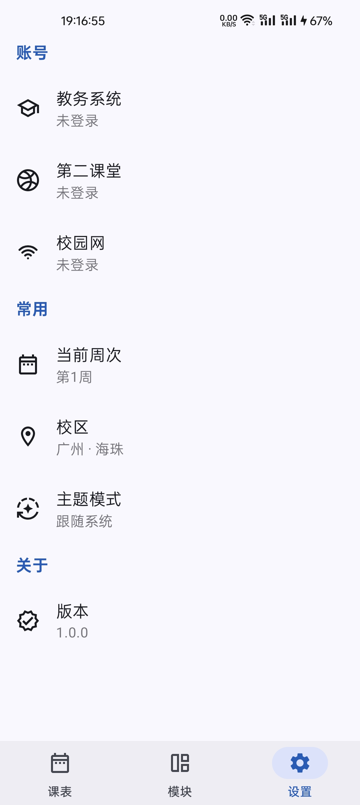
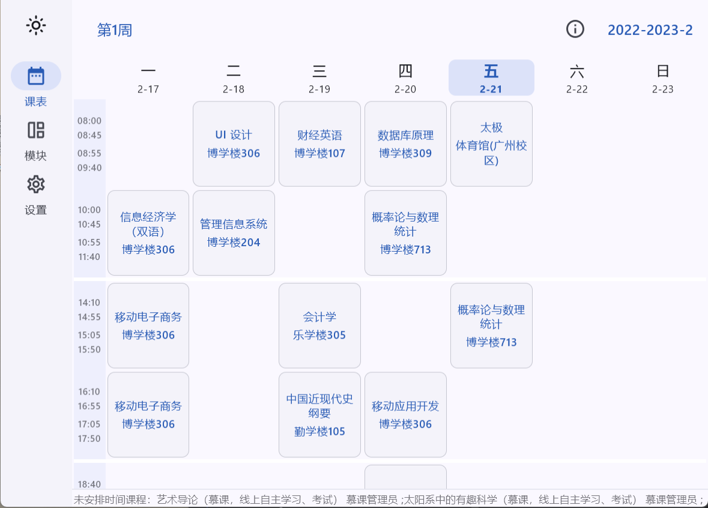

# 小石榴 跨平台版本（Punica CMP）

> 安全、美观的广东财经大学教务系统**三方**客户端。

    

[**更新日志**](readme/CHANGELOG.md)

## 支持的平台

- Android
- Windows

## 快速开始

1. 下载软件。你可以在[发行版](https://github.com/Kiteio/Punica-CMP/releases)中下载石榴。

2. 登录账号。打开软件（记得连上校园网或开启VPN），切换到设置页面，打开教务系统账号页面，点击右上角加号，登录教务系统账号。
    

        
    

## 支持

如果你喜欢石榴，请点亮仓库星标，向好友分享，让更多人发现它。

石榴没有引入任何的广告，换句话说，它并没有给开发者带来任何收入。石榴的登录功能使用了 [Yes Captcha](https://yescaptcha.com/i/OCv82F)（此链接为推荐连接）识别教务系统验证码，其功能需要支付一定的费用，由开发者支付。 

如果有条件的话，可以前往[爱发电](https://afdian.com/a/kiteio)平台发起捐款，感谢你的支持！

## 截图

    
    
    

    

