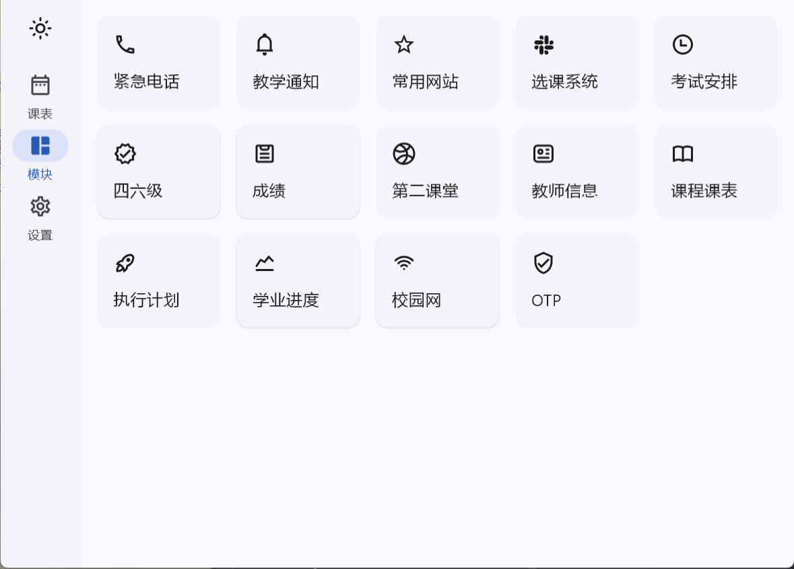
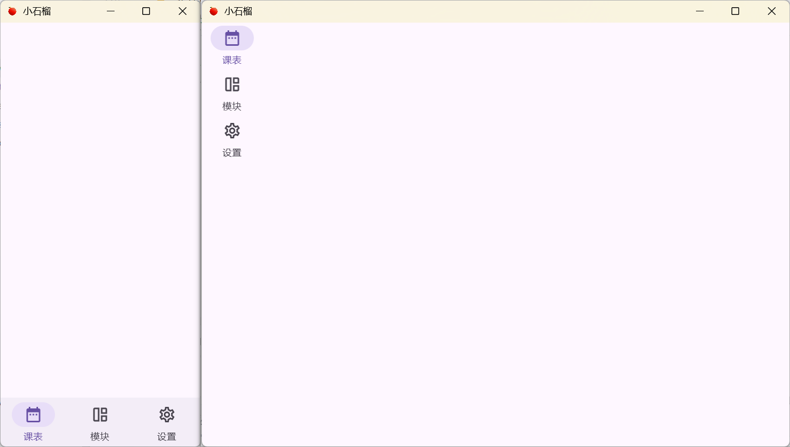

# 1.0.0

### 2025.2.21

- 添加：顶层导航页面内容

    **Android**

    

        
        
        
    

    **桌面端**

    

        
        
    

    

        
    

### 2025.2.17

- [**添加**：添加网页 VPN 客户端](https://github.com/Kiteio/Punica-CMP/commit/2c0a6b251468d37effaab445fe96998ea412f5ac)
- [**添加**：TOTP 功能](https://github.com/Kiteio/Punica-CMP/commit/ebc7a802d4739de9e0c9e3d3d49e028c5ccbcad7)

### 2025.2.16

- [**添加**：教务处客户端教务通知功能](https://github.com/Kiteio/Punica-CMP/commit/8d59938fc335c3ffd191ab5a85fc358463ee79ea)
- [**添加**：第二课堂客户端功能](https://github.com/Kiteio/Punica-CMP/commit/73e979ba89fa5c2b174b910d91a58f3bdfa69459)
- [**添加**：CET 客户端功能](https://github.com/Kiteio/Punica-CMP/commit/a5504d50d3321b3dd141b54f2d164bb8b52b7ae5)

### 2025.2.15

- [**添加**：选课系统客户端功能](https://github.com/Kiteio/Punica-CMP/commit/cf57c9c17acb230624fd71d2a883bba33c7cc4c7)

### 2025.2.14

- [**添加**：选课系统客户端](https://github.com/Kiteio/Punica-CMP/commit/e6d88398c02adda1969c6addefd4866b70e22ba1)
- [**添加**：教务系统客户端课程课表功能](https://github.com/Kiteio/Punica-CMP/commit/76f80d7f51dd4b6edf4fe9a3355654093a9644e8)
- [**添加**：教务系统客户端教师信息功能](https://github.com/Kiteio/Punica-CMP/commit/324f95be9a4c0ccdd7ef7891954a03d4c9ff2132)

### 2025.2.12

- [**添加**：教务系统客户端学期日历功能](https://github.com/Kiteio/Punica-CMP/commit/7260d37e45873cbad3aef7c7cfc8c95e2d657fe8)
- [**添加**：教务系统客户端学业进度功能](https://github.com/Kiteio/Punica-CMP/commit/2d7c98be2cdbccbea759f6eaf03a26c05cbdfca1)
- [**修改**：教务系统客户端功能优化](https://github.com/Kiteio/Punica-CMP/commit/678d127b66e67d098ed8b89d6dfd60c1d814bd23)
- [**添加**：教务系统客户端执行计划功能](https://github.com/Kiteio/Punica-CMP/commit/b781f215221051a85d651ef4a72dd828b50fe659)
- [**添加**：教务系统客户端考试安排功能](https://github.com/Kiteio/Punica-CMP/commit/25e06480edf5408926b1c3b7159f01a144fc2cc8)
- [**添加**：教务系统客户端成绩功能](https://github.com/Kiteio/Punica-CMP/commit/eaae33bcde4e8362715bfb32fee639c4e3fbcf62)

### 2025.2.11

- [**添加**：教务系统客户端校园网默认密码功能](https://github.com/Kiteio/Punica-CMP/commit/524c27c26fbfd0c3742e7aaa7e1104e9d7a7c415)
- [**添加**：导航页面](https://github.com/Kiteio/Punica-CMP/commit/d3998ca41c9c0f0c90b4610c174b0dce1c530847)
    

### 2025.2.10

- [**更新依赖**](https://github.com/Kiteio/Punica-CMP/commit/c3e2b82d4166a65f6761b64167f807e17e931d00)

### 2025.2.9

- [**添加**：教务系统客户端课表功能](https://github.com/Kiteio/Punica-CMP/commit/ed5ab2cbb9c4efcc643f5713fa2653f752545eff)

### 2025.2.1

- [**添加**：教务系统客户端登录功能](https://github.com/Kiteio/Punica-CMP/commit/c95bdc46d1050e205b2090bd4bea9de7fa20fd34)
- [**添加**：YesCaptcha 客户端](https://github.com/Kiteio/Punica-CMP/commit/ae16fc394ebc186f0890abce0b8d130ce382ed8e)
- [**修改**：http 客户端错误更正](https://github.com/Kiteio/Punica-CMP/commit/ed5f6ae23cf7bca20ff07f4ec7d6c8fbbbcfb05a)

### 2025.1.17

- [**添加**：Ktor 客户端](https://github.com/Kiteio/Punica-CMP/commit/120715dc50f0d73eeb2df43816e7e41e79c6fed5)

### 2025.1.9

- [**添加**：规范](https://github.com/Kiteio/Punica-CMP/commit/6d4162f44a2582977ac7a4177c9fdf092460046d)
- [**添加**：更新日志](https://github.com/Kiteio/Punica-CMP/commit/a43648cd0f18810a7e4465300f9b10b5c7b4e5be)
- [**添加**：MIT License](https://github.com/Kiteio/Punica-CMP/commit/7a90b8ef073549dbca4c9f34e7b669c42191eead)

### 2025.1.8

- [**项目初始化**](https://github.com/Kiteio/Punica-CMP/commit/8556fdf0fca0380a303db7337743f1e2162e4970)