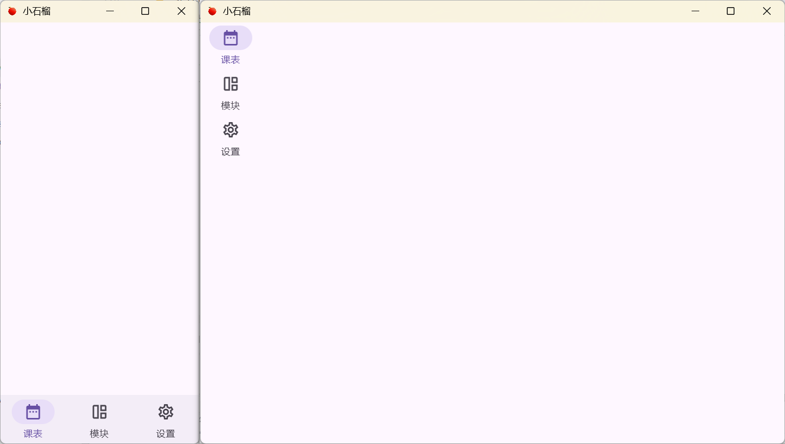

# 1.0.0

### 2025.2.11

- **添加**：教务系统客户端校园网默认密码功能
- [**添加**：导航页面](https://github.com/Kiteio/Punica-CMP/commit/d3998ca41c9c0f0c90b4610c174b0dce1c530847)
    

### 2025.2.10

- [**更新依赖**](https://github.com/Kiteio/Punica-CMP/commit/c3e2b82d4166a65f6761b64167f807e17e931d00)

### 2025.2.9

- [**添加**：教务系统客户端课表功能](https://github.com/Kiteio/Punica-CMP/commit/ed5ab2cbb9c4efcc643f5713fa2653f752545eff)

### 2025.2.1

- [**添加**：教务系统客户端登录功能](https://github.com/Kiteio/Punica-CMP/commit/c95bdc46d1050e205b2090bd4bea9de7fa20fd34)
- [**添加**：YesCaptcha 客户端](https://github.com/Kiteio/Punica-CMP/commit/ae16fc394ebc186f0890abce0b8d130ce382ed8e)
- [**修改**：http 客户端错误更正](https://github.com/Kiteio/Punica-CMP/commit/ed5f6ae23cf7bca20ff07f4ec7d6c8fbbbcfb05a)

### 2025.1.17

- [**添加**：Ktor 客户端](https://github.com/Kiteio/Punica-CMP/commit/120715dc50f0d73eeb2df43816e7e41e79c6fed5)

### 2025.1.9

- [**添加**：规范](https://github.com/Kiteio/Punica-CMP/commit/6d4162f44a2582977ac7a4177c9fdf092460046d)
- [**添加**：更新日志](https://github.com/Kiteio/Punica-CMP/commit/a43648cd0f18810a7e4465300f9b10b5c7b4e5be)
- [**添加**：MIT License](https://github.com/Kiteio/Punica-CMP/commit/7a90b8ef073549dbca4c9f34e7b669c42191eead)

### 2025.1.8

- [**项目初始化**](https://github.com/Kiteio/Punica-CMP/commit/8556fdf0fca0380a303db7337743f1e2162e4970)